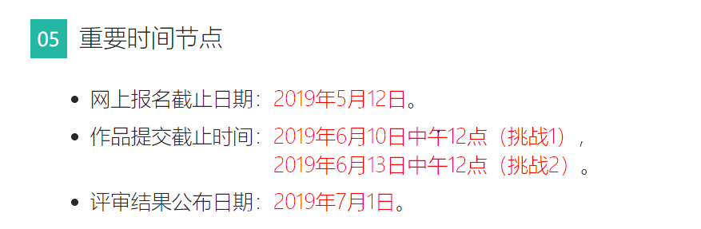

# ChinaVis

19/04/2019
---
**数据处理**：武春媛

1. 每个传感器对应的场馆
   - 建立给场馆编号的字典
   - 在传感器布置表后加一列：传感器对应场馆编号
2. 三天传感器日志整合，调整时间格式，划分时间片
3. 数据格式：字段名不变，格式json

**数据分析**：盛诗颖

把人员流动情况根据地图画出一个简单的动态效果来

便于通过观察进行进一步视图和框架的设计。

**下次开会时间**：4-23 14:00:00
其他人任务：

观察数据和解决问题，提出具有可行性的视图设计。

下次开会时根据大家提出的视图和实现的动态效果设计框架。

24/04/2019
---
**数据处理**：武春媛

1. 按照人员在所有数据按时间顺序处理
2. 按照房间在所有数据按时间顺序处理
3. 数据处理好后可以放入数据库：MySQL

**问题分析**：

- 人员类型：
  - 做报告的（资深专家，商业大咖等）
  - 媒体记者（怎么区分？）
  - 参展单位（展厅和海报区）
  - 工作人员
  - 参会人员
- 异常行为分析：
  - 预设异常的行为模式
  - 行为模式分类（按照房间，展示所有具体的行为模式）
  - 按照人的轨迹聚类（行为模式聚类），至少把参会人员和其他人员区分

**视图设计**：

1. 地图：主视图（两层楼切换，当选定并观察某一个人的时候可以两层楼并派）
   - 观察单个人的行为时，将整体人员分布变成热图，观察单个人和整体行为模式的区别，画这个人一整天的轨迹（或者传感器亮一下）
   - 观察单个人的行为时，在同一种人员类型下观察
2. 时间轴
   - 人员折线图：观察单个人在整个时间轴的移动频率
   - 房间折线图：观察房间在整个时间轴的人员数量
3. 行为模式图（看行为模式分析的算法分析出来的效果）

**下次开会时间**：4-30 13:00:00

**任务分配**：

刘威，韩欣颖：搭框架（时间轴和地图）

陈圣涛：数据处理

盛诗颖：行为模式

武春媛：聚类

**工具**

后端python: flask
前端: 简单的js

**ddl**
